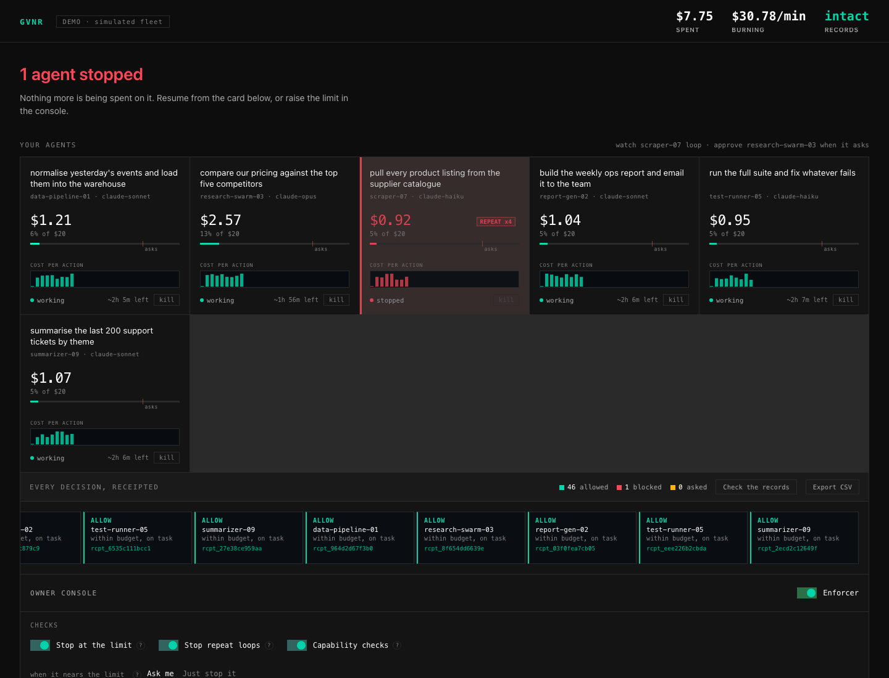

# Enforcer Governor (GVNR)

**[gvnr.io](https://gvnr.io)** · stops AI agents overspending and running dangerous commands, before the action runs. Free, self-hosted, and an MCP server for any MCP client.

[](https://github.com/instruxi-io/enforcer-governor/actions/workflows/ci.yml)
[](https://www.npmjs.com/package/enforcer-governor)
[](https://www.npmjs.com/package/enforcer-governor)
[](LICENSE)
[](https://nodejs.org)

[](https://gvnr.io/console.html)

*The dashboard, running the [live demo](https://gvnr.io/console.html) with a simulated fleet. Every agent shows what it was asked to do, what it has spent against its cap, and how long it can keep working. Each decision at the bottom is hash-chained to the one before it.*

A guard that sits in front of an AI agent and decides, before each action runs, whether it is allowed. Any agent, any provider, on your own machine.

AI agents burn tokens, and tokens are money. They get stuck in loops, repeat work, and blow through budgets, and most tools only *report* the damage afterwards. GVNR is a guard that stands in front of your agents and answers one question before every action:

> **May this agent do this, right now?**

- **allow**: in budget and on task, carry on
- **deny**: over its spend cap, stuck in a loop, or a refused command, blocked
- **escalate**: irreversible, or spending too fast, so it pauses and asks YOU

Every decision leaves a **tamper-evident receipt**, so you can always prove what your agents did and who approved what. Everything runs on your own computer with your own keys. Nothing is sent to us, ever.

**See it in 10 seconds** (no install, simulated agents): **https://gvnr.io/console.html**

Licensed [FSL-1.1-ALv2](LICENSE): free to run on your own agents, in production, commercially. Becomes Apache 2.0 two years after each release. Source-available rather than OSI open source, so it is described as free and self-hosted.
---

## Where this sits

Spend caps are no longer unique, and it would be dishonest to imply otherwise. Anthropic ships usage-credit limits at organization, group and member level, workspace spend limits on the Console, and a self-hosted gateway with per-user caps that block requests. Third-party tools cap Claude Code spend per session, day, week and month.

What none of them do is decide **whether an action is allowed at all**:

| | Sees spend | Stops spend | Gates the ACTION | Names who it acted for | Tamper-evident |
|---|---|---|---|---|---|
| Provider dashboards | after the fact | no | no | no | no |
| Observability tools (Helicone, Langfuse, ccusage) | yes | no | no | no | logs, editable |
| LLM gateways (LiteLLM, Portkey) | yes | hard cutoff | no | per key | logs, editable |
| Native and third-party spend caps | yes | yes | **no** | no | no |
| **Enforcer Governor** | **live** | **per agent and per fleet** | **yes, before it runs** | **yes** | **hash-chained** |

A spend cap answers "can it afford this?". It has no opinion on `curl | sh`, on `rm -rf`, or on reading your `.env`, all of which are cheap. This asks the question Enforcer asks everywhere else: is this actor permitted to do this, right now, and who authorised it.

---

## What you need

One thing: **Node.js**, a free tool most developers already have. Check by typing `node --version` in a terminal. If that fails, install it from [nodejs.org](https://nodejs.org) (big green button, two clicks).

---

## Three things, not one

**Control.** What the agent may DO, checked before it does it. Piping the internet into a shell is refused outright. Deleting a tree, rewriting git history, reading credentials, publishing or deploying: those stop and ask you. Ordinary work passes untouched. These are capability decisions, not spend ones, so they fire with a full budget.

**Receipts.** Every decision is hash-chained, and each one names the human the agent was acting for, the tool it tried to use, the model answering, and the rule that decided. Edit or delete a single record and the chain visibly breaks. Those are the fields an audit asks for, recorded as fields rather than buried in prose.

**Spend.** A dollar limit per agent, a soft cap that asks you before it keeps going, and total caps across every agent per day, week and month. Loops and repeated work are caught on behaviour, not just cost.

**Speed, not just totals.** The incidents that actually cost people money are rate incidents, and every cap that ships elsewhere is a total. Three shapes are watched:

- **Dollars per minute**, per agent and across the fleet. Ordinary work sits around $0.10 to $0.25 a minute, so the defaults of $2 and $10 leave normal sessions alone.
- **New agents per minute.** A team that starts over an hour is a choice. Eight appearing inside a minute is an orchestrator spawning orchestrators, which is how one documented session reached 49 subagents before anyone looked.
- **Errors per minute.** A rate-limited call fails cheaply; the retry after it does not. One report had 96% of attempts coming back rate limited while the wrapper kept paying for the rest.

Each one **asks** rather than blocks, and asks once, so an overnight run stops and waits for you instead of dying or nagging.

It does **not** claim to detect hallucination. Nobody can do that reliably. It catches the mechanical waste that is actually detectable, and escalates the judgment calls to you.

---

## Start it (one command)

Open a terminal and run:

```bash
npx --yes enforcer-governor start
```

The first run downloads it (a few seconds), then **your dashboard opens in the browser by itself**. Leave this terminal running; it is the guard. The dashboard tells you what to do next. Stop it any time with Ctrl+C, and your agents keep working normally.

### Route one: point any agent at it

The general case. Anything that talks to an API, on any provider, in any language.

```bash
# OpenAI-shaped agents (also Gemini, Grok, Groq, Together, most local runtimes)
export OPENAI_BASE_URL=http://localhost:4000/v1

# Anthropic-shaped agents
export ANTHROPIC_BASE_URL=http://localhost:4000
```

Every request now passes through the governor. It meters real usage from each response and refuses (HTTP 429) once an agent is over budget or grounded. Tag requests per agent with an `x-enforcer-agent: <name>` header so they show up separately on the dashboard.

For anything that speaks the OpenAI chat-completions shape but lives elsewhere, tell the governor where to forward:

```bash
# Gemini
GOVERNOR_OPENAI_URL=https://generativelanguage.googleapis.com/v1beta/openai/chat/completions \
  npx --yes enforcer-governor start

# Grok
GOVERNOR_OPENAI_URL=https://api.x.ai/v1/chat/completions npx --yes enforcer-governor start

# a local runtime
GOVERNOR_OPENAI_URL=http://localhost:11434/v1/chat/completions npx --yes enforcer-governor start

# OpenRouter, which puts 400+ models behind one endpoint
GOVERNOR_OPENAI_URL=https://openrouter.ai/api/v1/chat/completions npx --yes enforcer-governor start
```

OpenRouter is worth calling out because it solves a different problem and the two compose. It picks a model per turn and bills you for it; it is a marketplace, and a marketplace has no reason to ship a hard stop. The governor sits in front of it and supplies what it does not: a limit that actually stops an agent, a check on what the agent may DO rather than what it may spend, and a receipt for every decision.

### Route two: a coding agent with hook support

Some coding agents let a tool inspect an action **before** it runs. Where that exists it is the stronger route, because a refused action never executes at all rather than being refused at the API, and it catches actions that cost nothing (`rm -rf`, reading a `.env`) which an API-level guard never sees. Claude Code is the one wired today.

In a **second** terminal, go into the project you want watched and run:

```bash
npx --yes enforcer-governor install-hook
```

Then start a **new** session in that project. That is all. Add `--global` to watch every project at once. To remove it, press **Remove Enforcer** at the bottom of the dashboard, or run `npx enforcer-governor uninstall-hook`.

> The public ChatGPT website is closed and cannot be governed. Anything built on the OpenAI **API** can.

---

## Use it from any MCP client

GVNR is also an MCP server, so Cursor, Claude Desktop, Claude Code, Windsurf or any other MCP client can use it. Start the governor, then add the server:

```bash
npx --yes enforcer-governor start          # the governor and its dashboard
claude mcp add gvnr -- npx -y enforcer-governor mcp
```

Or in any client's MCP config:

```json
{ "mcpServers": { "gvnr": { "command": "npx", "args": ["-y", "enforcer-governor", "mcp"] } } }
```

| Tool | What it does |
|---|---|
| `gvnr_request_permission` | Ask before acting. Returns allow, deny or ask_human, and records a receipt. |
| `gvnr_status` | Every agent, its spend and spend rate, and the limits in force. |
| `gvnr_recent_decisions` | The latest decisions from the receipt file. |
| `gvnr_verify_receipts` | Checks the hash chain and names the line if a record was edited. |
| `gvnr_stop_agent` | Stops an agent. Only a human can resume it, from the dashboard. |

Each server process is one agent, shown as `mcp:<name>`: set `GVNR_AGENT` in the client config to name it, otherwise it gets a random id per session. The agent cannot pick or change its own id.

Two things to know. Asking permission over MCP is cooperative: an agent that calls the tool gets a real verdict, but nothing forces an agent to call it, so the Claude Code hook remains the enforced route. And nothing in the tool list can loosen a limit: no approve, resume or config, because the agent calling the tools is the one being governed.

Listed on the official MCP Registry as `io.gvnr/enforcer-governor`.

## Configure

Drop a `governor.config.json` in the directory you run it from:

```json
{
  "dollars": 20,
  "model": "claude-opus-5",
  "soft": 0.75,
  "loopLimit": 4,
  "softAction": "escalate",
  "burnLimit": 2,
  "fleetBurnLimit": 10,
  "fanoutLimit": 8,
  "retryLimit": 6,
  "port": 4000
}
```

**Set the limit in dollars.** `dollars` is the spend cap per agent per session; `model` is which model's prices convert it into a token budget. The dashboard shows you what that buys before anything runs: how many tokens, and roughly how long an agent can work on it. Change it there at any time; agents already running pick up the new limit immediately, and one that was stopped for hitting the old limit is released.

**Claude, ChatGPT, Gemini and Grok are all supported, and the model is detected for you.** Every agent reports which model answered, so the governor prices each one at its own rate and the dashboard's picker follows whatever it sees. `$20` means $20 whether that agent is on Opus 5, GPT-5 mini or Gemini 2.5 Pro. Pick a model by hand and your choice sticks.

Under the hood the cap is **cost-weighted effective tokens**, not raw counts. Cached sessions re-read their whole context every turn, so raw sums explode into the billions while costing very little. The governor weights by price instead, so one effective token is one input-token of cost at that model's price and `dollars` converts with a single multiply.

The weights are per model, because the output multiplier is not a constant: Anthropic prices output at 5x input across its range, OpenAI runs 4x to 8x, and Gemini runs 4x to 8.33x. Cached input differs too. Two Gemini caveats are baked in: the Flash 3.7/3.6 rates are the ones in force through 2026-12-31, and the Pro rates are the sub-200k-prompt tier. `$20` is 4,000,000 effective tokens on Opus 5, 2,000,000 on Fable 5 and 10,000,000 on Sonnet 5. Set `budget` directly instead if you would rather think in tokens.

Prices are the providers' published list rates. **On a flat subscription you are not billed per token**, so read the dollar figures as equivalent API cost rather than an invoice. When an API key is present in the environment the same work may be billing per token instead of against your plan, which is where the nastiest surprise bills come from, so the dashboard flags that agent rather than leaving you to find out on the invoice.

`softAction` is `"escalate"` (ask a human) or `"deny"` (auto-block at the soft cap). Everything is also flippable live from the dashboard switches.

---

## When the budget runs out, finish somewhere cheaper

`reroute` is the fourth verb, and it is off unless you ask for it. When an agent hits its limit the choice is normally stop or keep paying. This adds a third: hand the job to a cheaper or local model and carry on.

```json
{
  "rerouteOn": true,
  "fallbackUrl": "http://127.0.0.1:1234/v1/chat/completions",
  "fallbackModel": "qwen/qwen3.6-27b"
}
```

It is **not** a context transfer. Repointing a provider mid-session leaves the new one with nothing, and resending a long transcript is the expensive move because the prompt cache is per provider. Instead the outgoing model writes a short structured brief, and the incoming model starts from that: small enough for any window including a local one, with nothing large to re-read.

Two rules come with it. The brief is written by the **outgoing** model, because it did the reasoning. And the cut lands on a user turn, so an assistant tool call is never separated from its tool result. It fires once per agent, because repeated compaction degrades a session as recursive summaries distort earlier reasoning.

Measured against a local Qwen 3.6 27B on the same task, scored on a fixed checklist written before the runs:

| given | score |
|---|---|
| the full transcript | 6/7 |
| **the brief alone** | **7/7** |
| nothing | 0/7 |

Three things worth knowing before you turn it on. A local model is slow, so this waits: eight minutes for the run above, which is the price of free tokens. `max_tokens` counts reasoning on a reasoning model, so a brief asked for with a small budget can come back empty. And a brief under 80 characters is refused rather than handed over, because a fallback starting from nothing looks exactly like one that lost the task.

---

## Working for more than one client

An agency running five projects needs spend split by client, and the honest problem with that is labelling: nobody tags every session reliably, and the one they forget is the one they cannot bill.

So it is derived. Claude Code tells the hook its working directory on every call, and work for a client almost always lives in that client's folder. Map each folder once:

```json
{
  "clients": {
    "/Users/me/work/acme": "Acme Corp",
    "/Users/me/work/beta": "Beta Ltd"
  },
  "clientLimits": { "Beta Ltd": 400 }
}
```

Every session in those folders is attributed from then on with nobody typing anything. The longest matching prefix wins, so `~/work/acme/api` is Acme even when `~/work` is mapped to something else. On the API route there is no working directory, so one header does the same job: `x-enforcer-client: Acme Corp`.

A folder you have not mapped is still counted, under a guessed name marked with `?`, because losing the work is worse than guessing at it. It is marked precisely so it does not go on an invoice as though it were certain.

`clientLimits` caps a client for the month. A project that has eaten its budget stops on its own, and the other four carry on. Every receipt carries the client, and it is the first column of the CSV export, so the invoice is a filter rather than a reconstruction.

---

## How it works

```
coding agent ─hook─┐
                    ├──► Governor ──► allow / deny / escalate ──► hash-chained receipt
other agents ─proxy─┘        │
                             └──► dashboard (live gauges + decision tape)
```

Everything is set from the **owner console** on the dashboard: one panel with a fader for each limit and a switch for each check, so there is one place to answer what these agents may do and what they may spend.

- **Hook**: reads the session transcript, totals the tokens, asks the governor, and translates the verdict into the agent's own allow / deny / ask. If the governor is down it fails **open**, so it never blocks your real work.
- **Proxy**: a passthrough for `/v1/messages` and `/v1/chat/completions` that reads exact usage from responses and refuses when an agent is over its limit. This is the tamper-resistant path, since it runs server-side.
- **Receipts**: appended to `~/.enforcer-governor/receipts.jsonl`, each line carrying its own hash, folded in from the previous line. `GET /verify` walks the **file** and names the first line that does not add up, so an edit or a deletion anywhere in the history is caught, including in a stretch written before the last restart. Receipts written by versions before 0.11 have no stored hash and are reported as `unverifiable` rather than quietly passed.

## Honest limits

- The proxy buffers responses; streaming passthrough is next.
- Token totals come from the transcript, which writes asynchronously, so a decision can lag real spend by one turn. Enforcement at the tool boundary makes this safe in practice.
- On subscription billing, dollar figures are estimates at list prices, labelled `est.`
- The governor answers only this machine: loopback connections, local Host headers, and no cross-origin requests. Controls that loosen a limit (settings, approve, resume, remove) need a key that changes on every start and lives only in the dashboard page. That stops a stray `curl` or another website; an agent with a shell running as you could still load the dashboard and read the key. Against a deliberate adversary rather than an accident, run the agent in a container or VM and keep GVNR on the host.
- If GVNR is not running, the hook lets actions through and says so, rather than breaking your agent.

## Run the tests

```bash
npm test
```

## The bigger picture: Enforcer

The Governor is one idea applied to one resource. The idea is **Enforcer**, Instruxi's policy engine, and it asks a single question in front of every system it guards:

> **May this identity do this, right now?**

Answered three ways (allow, deny, escalate to a human), with a tamper-evident receipt for every answer. Here that identity is an AI agent and the resource is your money. In the full Enforcer platform the same verbs govern who reads a record, who moves funds, who issues a credential, and who approved the exception, across people, services, and agents, for teams that have to prove it to an auditor afterwards.

So this repo is also a working argument: if three verbs and a receipt chain can tame runaway agents on your laptop, the same primitive scales to the systems behind them. That is what we build. **[instruxi.io](https://instruxi.io)**

## License

Functional Source License 1.1 (FSL-1.1-ALv2). Free to run on your own agents, in production, including commercially. You may not offer it as a competing commercial product or service. Becomes Apache 2.0 two years after each release. See [LICENSE](LICENSE). Built by [Instruxi](https://instruxi.io).
